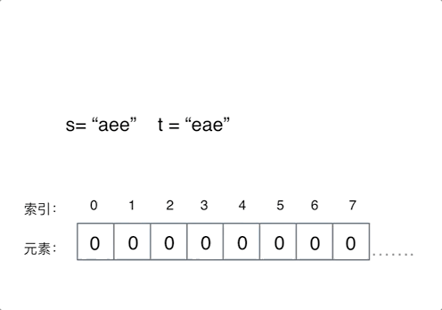

# 242.有效的字母异位词

[力扣题目链接(opens new window)](https://leetcode.cn/problems/valid-anagram/)

给定两个字符串 s 和 t ，编写一个函数来判断 t 是否是 s 的字母异位词。

示例 1: 输入: s = "anagram", t = "nagaram" 输出: true

示例 2: 输入: s = "rat", t = "car" 输出: false

**说明:** 你可以假设字符串只包含小写字母。

## [#](https://programmercarl.com/algo/hash-table/0242-valid-anagram.html#%E6%80%9D%E8%B7%AF)思路

先看暴力的解法，两层for循环，同时还要记录字符是否重复出现，很明显时间复杂度是 O(n^2)。

暴力的方法这里就不做介绍了，直接看一下有没有更优的方式。

 **数组其实就是一个简单哈希表** ，而且这道题目中字符串只有小写字符，那么就可以定义一个数组，来记录字符串s里字符出现的次数。

如果对哈希表的理论基础关于数组，set，map不了解的话可以看这篇：[关于哈希表，你该了解这些！](https://programmercarl.com/algo/hash-table/hash-table-basics.html)

需要定义一个多大的数组呢，定一个数组叫做record，大小为26 就可以了，初始化为0，因为字符a到字符z的ASCII也是26个连续的数值。

为了方便举例，判断一下字符串s= "aee", t = "eae"。

操作动画如下：



定义一个数组叫做record用来上记录字符串s里字符出现的次数。

需要把字符映射到数组也就是哈希表的索引下标上，**因为字符a到字符z的ASCII是26个连续的数值，所以字符a映射为下标0，相应的字符z映射为下标25。**

再遍历 字符串s的时候，**只需要将 s[i] - ‘a’ 所在的元素做+1 操作即可，并不需要记住字符a的ASCII，只要求出一个相对数值就可以了。** 这样就将字符串s中字符出现的次数，统计出来了。

那看一下如何检查字符串t中是否出现了这些字符，同样在遍历字符串t的时候，对t中出现的字符映射哈希表索引上的数值再做-1的操作。

那么最后检查一下，**record数组如果有的元素不为零0，说明字符串s和t一定是谁多了字符或者谁少了字符，return false。**

最后如果record数组所有元素都为零0，说明字符串s和t是字母异位词，return true。

时间复杂度为O(n)，空间上因为定义是的一个常量大小的辅助数组，所以空间复杂度为O(1)。

### Python：

```python
class Solution:
    def isAnagram(self, s: str, t: str) -> bool:
        record = [0] * 26
        for i in s:
            #并不需要记住字符a的ASCII，只要求出一个相对数值就可以了
            record[ord(i) - ord("a")] += 1
        for i in t:
            record[ord(i) - ord("a")] -= 1
        for i in range(26):
            if record[i] != 0:
                #record数组如果有的元素不为零0，说明字符串s和t 一定是谁多了字符或者谁少了字符。
                return False
        return True
```

Python写法二（没有使用数组作为哈希表，只是介绍defaultdict这样一种解题思路）：

```python
class Solution:
    def isAnagram(self, s: str, t: str) -> bool:
        from collections import defaultdict
    
        s_dict = defaultdict(int)
        t_dict = defaultdict(int)
        for x in s:
            s_dict[x] += 1
    
        for x in t:
            t_dict[x] += 1
        return s_dict == t_dict
```

Python写法三(没有使用数组作为哈希表，只是介绍Counter这种更方便的解题思路)：

```python
class Solution(object):
    def isAnagram(self, s: str, t: str) -> bool:
        from collections import Counter
        a_count = Counter(s)
        b_count = Counter(t)
        return a_count == b_count
```
