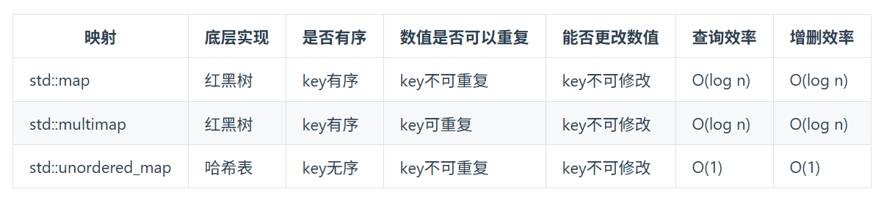

1. 两数之和
   力扣题目链接
   (opens new window)
   给定一个整数数组 nums 和一个目标值 target，请你在该数组中找出和为目标值的那 两个 整数，并返回他们的数组下标。
   你可以假设每种输入只会对应一个答案。但是，数组中同一个元素不能使用两遍。
   示例:
   给定 nums = [2, 7, 11, 15], target = 9
   因为 nums[0] + nums[1] = 2 + 7 = 9
   所以返回 [0, 1]

思路
很明显暴力的解法是两层for循环查找，时间复杂度是O(n^2)。
建议大家做这道题目之前，先做一下这两道
• 242. 有效的字母异位词
• 349. 两个数组的交集
242. 有效的字母异位词 这道题目是用数组作为哈希表来解决哈希问题，349. 两个数组的交集这道题目是通过set作为哈希表来解决哈希问题。
首先我再强调一下 什么时候使用哈希法，当我们需要查询一个元素是否出现过，或者一个元素是否在集合里的时候，就要第一时间想到哈希法。
本题呢，我就需要一个集合来存放我们遍历过的元素，然后在遍历数组的时候去询问这个集合，某元素是否遍历过，也就是 是否出现在这个集合。
那么我们就应该想到使用哈希法了。
因为本题，我们不仅要知道元素有没有遍历过，还要知道这个元素对应的下标，需要使用 key value结构来存放，key来存元素，value来存下标，那么使用map正合适。
再来看一下使用数组和set来做哈希法的局限。
• 数组的大小是受限制的，而且如果元素很少，而哈希值太大会造成内存空间的浪费。
• set是一个集合，里面放的元素只能是一个key，而两数之和这道题目，不仅要判断y是否存在而且还要记录y的下标位置，因为要返回x 和 y的下标。所以set 也不能用。
此时就要选择另一种数据结构：map ，map是一种key value的存储结构，可以用key保存数值，用value再保存数值所在的下标。
C++中map，有三种类型：



std::unordered_map 底层实现为哈希表，std::map 和std::multimap 的底层实现是红黑树。
同理，std::map 和std::multimap 的key也是有序的（这个问题也经常作为面试题，考察对语言容器底层的理解）。 更多哈希表的理论知识请看关于哈希表，你该了解这些！。
这道题目中并不需要key有序，选择std::unordered_map 效率更高！ 使用其他语言的录友注意了解一下自己所用语言的数据结构就行。
接下来需要明确两点：
• map用来做什么
• map中key和value分别表示什么
map目的用来存放我们访问过的元素，因为遍历数组的时候，需要记录我们之前遍历过哪些元素和对应的下标，这样才能找到与当前元素相匹配的（也就是相加等于target）
接下来是map中key和value分别表示什么。
这道题 我们需要 给出一个元素，判断这个元素是否出现过，如果出现过，返回这个元素的下标。
那么判断元素是否出现，这个元素就要作为key，所以数组中的元素作为key，有key对应的就是value，value用来存下标。
所以 map中的存储结构为 {key：数据元素，value：数组元素对应的下标}。
在遍历数组的时候，只需要向map去查询是否有和目前遍历元素匹配的数值，如果有，就找到的匹配对，如果没有，就把目前遍历的元素放进map中，因为map存放的就是我们访问过的元素。
过程如下


```Python
class Solution:
    def twoSum(self, nums: List[int], target: int) -> List[int]:
        records = dict()

        for index, value in enumerate(nums):  
            if target - value in records:   # 遍历当前元素，并在map中寻找是否有匹配的key
                return [records[target- value], index]
            records[value] = index    # 如果没找到匹配对，就把访问过的元素和下标加入到map中
        return []
```
