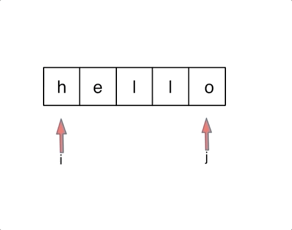

[力扣题目链接(opens new window)](https://leetcode.cn/problems/reverse-string/)

编写一个函数，其作用是将输入的字符串反转过来。输入字符串以字符数组 char[] 的形式给出。

不要给另外的数组分配额外的空间，你必须原地修改输入数组、使用 O(1) 的额外空间解决这一问题。

你可以假设数组中的所有字符都是 ASCII 码表中的可打印字符。

示例 1：
输入：["h","e","l","l","o"]
输出：["o","l","l","e","h"]

示例 2：
输入：["H","a","n","n","a","h"]
输出：["h","a","n","n","a","H"]

## # 思路

先说一说题外话：

对于这道题目一些同学直接用C++里的一个库函数 reverse，调一下直接完事了， 相信每一门编程语言都有这样的库函数。

如果这么做题的话，这样大家不会清楚反转字符串的实现原理了。

但是也不是说库函数就不能用，是要分场景的。

如果在现场面试中，我们什么时候使用库函数，什么时候不要用库函数呢？

**如果题目关键的部分直接用库函数就可以解决，建议不要使用库函数。**

毕竟面试官一定不是考察你对库函数的熟悉程度， 如果使用python和java 的同学更需要注意这一点，因为python、java提供的库函数十分丰富。

**如果库函数仅仅是 解题过程中的一小部分，并且你已经很清楚这个库函数的内部实现原理的话，可以考虑使用库函数。**

建议大家平时在leetcode上练习算法的时候本着这样的原则去练习，这样才有助于我们对算法的理解。

不要沉迷于使用库函数一行代码解决题目之类的技巧，不是说这些技巧不好，而是说这些技巧可以用来娱乐一下。

真正自己写的时候，要保证理解可以实现是相应的功能。

接下来再来讲一下如何解决反转字符串的问题。

大家应该还记得，我们已经讲过了[206.反转链表](https://programmercarl.com/algo/linked-list/0206-reverse-linked-list.html)。

在反转链表中，使用了双指针的方法。

那么反转字符串依然是使用双指针的方法，只不过对于字符串的反转，其实要比链表简单一些。

因为字符串也是一种数组，所以元素在内存中是连续分布，这就决定了反转链表和反转字符串方式上还是有所差异的。

如果对数组和链表原理不清楚的同学，可以看这两篇，[关于链表，你该了解这些！](https://programmercarl.com/algo/linked-list/linked-list-basics.html)，[必须掌握的数组理论知识](https://programmercarl.com/algo/array/array-basics.html)。

对于字符串，我们定义两个指针（也可以说是索引下标），一个从字符串前面，一个从字符串后面，两个指针同时向中间移动，并交换元素。

以字符串`hello`为例，过程如下：




不难写出如下C++代码:

```C++
void reverseString(vector<char></char>& s) {
    for (int i = 0, j = s.size() - 1; i < s.size()/2; i++, j--) {
        swap(s[i],s[j]);
    }
}
```

循环里只要做交换s[i] 和s[j]操作就可以了，那么我这里使用了swap 这个库函数。大家可以使用。
因为相信大家都知道交换函数如何实现，而且这个库函数仅仅是解题中的一部分， 所以这里使用库函数也是可以的。
swap可以有两种实现。
一种就是常见的交换数值：

```C++
int tmp = s[i];
s[i] = s[j];
s[j] = tmp;
```


一种就是通过位运算：

```C++
s[i] ^= s[j];
s[j] ^= s[i];
s[i] ^= s[j];
```


这道题目还是比较简单的，但是我正好可以通过这道题目说一说在刷题的时候，使用库函数的原则。

如果题目关键的部分直接用库函数就可以解决，建议不要使用库函数。

如果库函数仅仅是 解题过程中的一小部分，并且你已经很清楚这个库函数的内部实现原理的话，可以考虑使用库函数。

本着这样的原则，我没有使用reverse库函数，而使用swap库函数。

在字符串相关的题目中，库函数对大家的诱惑力是非常大的，因为会有各种反转，切割取词之类的操作，这也是为什么字符串的库函数这么丰富的原因。

相信大家本着我所讲述的原则来做字符串相关的题目，在选择库函数的角度上会有所原则，也会有所收获。

C++代码如下：

```C++
class Solution {
public:
    void reverseString(vector<char></char>& s) {
        for (int i = 0, j = s.size() - 1; i < s.size()/2; i++, j--) {
            swap(s[i],s[j]);
        }
    }
};

时间复杂度: O(n)
空间复杂度: O(1)
```

## python:

```Python
class Solution:
    def reverseString(self, s: List[str]) -> None:
        """
        Do not return anything, modify s in-place instead.
        """
        left, right = 0, len(s) - 1
      
        # 该方法已经不需要判断奇偶数，经测试后时间空间复杂度比用 for i in range(len(s)//2)更低
        # 因为while每次循环需要进行条件判断，而range函数不需要，直接生成数字，因此时间复杂度更低。推荐使用range
        while left < right:
            s[left], s[right] = s[right], s[left]
            left += 1
            right -= 1
```
