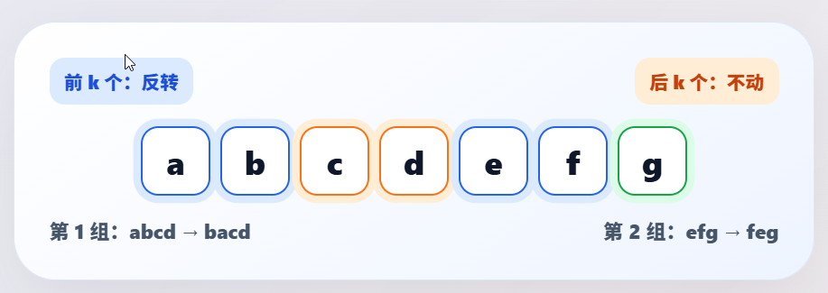

## 541.反转字符串II

力扣题目链接(opens new window)

给定一个字符串 s 和一个整数 k，从字符串开头算起, 每计数至 2k 个字符，就反转这 2k 个字符中的前 k 个字符。

如果剩余字符少于 k 个，则将剩余字符全部反转。

如果剩余字符小于 2k 但大于或等于 k 个，则反转前 k 个字符，其余字符保持原样。

示例:

输入: s = "abcdefg", k = 2
输出: "bacdfeg"




## 思路

这道题目其实也是模拟，实现题目中规定的反转规则就可以了。

一些同学可能为了处理逻辑：每隔2k个字符的前k的字符，写了一堆逻辑代码或者再搞一个计数器，来统计2k，再统计前k个字符。

其实在遍历字符串的过程中，只要让 i += (2 * k)，i 每次移动 2 * k 就可以了，然后判断是否需要有反转的区间。

因为要找的也就是每2 * k 区间的起点，这样写，程序会高效很多。

**所以当需要固定规律一段一段去处理字符串的时候，要想想在for循环的表达式上做做文章。**

性能如下： 

那么这里具体反转的逻辑我们要不要使用库函数呢，其实用不用都可以，使用reverse来实现反转也没毛病，毕竟不是解题关键部分。

使用C++库函数reverse的版本如下：

```C++
class Solution {
public:
    string reverseStr(string s, int k) {
        for (int i = 0; i < s.size(); i += (2 * k)) {
            // 1. 每隔 2k 个字符的前 k 个字符进行反转
            // 2. 剩余字符小于 2k 但大于或等于 k 个，则反转前 k 个字符
            if (i + k <= s.size()) {
                reverse(s.begin() + i, s.begin() + i + k );
            } else {
                // 3. 剩余字符少于 k 个，则将剩余字符全部反转。
                reverse(s.begin() + i, s.end());
            }
        }
        return s;
    }
};
```

* 时间复杂度: O(n)
* 空间复杂度: O(1)

那么我们也可以实现自己的reverse函数，其实和题目[344. 反转字符串](https://programmercarl.com/algo/string/0344-reverse-string.html)道理是一样的。

下面我实现的reverse函数区间是左闭右闭区间，代码如下：

```C++
class Solution {
public:
    void reverse(string& s, int start, int end) {
        for (int i = start, j = end; i < j; i++, j--) {
            swap(s[i], s[j]);
        }
    }
    string reverseStr(string s, int k) {
        for (int i = 0; i < s.size(); i += (2 * k)) {
            // 1. 每隔 2k 个字符的前 k 个字符进行反转
            // 2. 剩余字符小于 2k 但大于或等于 k 个，则反转前 k 个字符
            if (i + k <= s.size()) {
                reverse(s, i, i + k - 1);
                continue;
            }
            // 3. 剩余字符少于 k 个，则将剩余字符全部反转。
            reverse(s, i, s.size() - 1);
        }
        return s;
    }
};
```

* 时间复杂度: O(n)
* 空间复杂度: O(1)或O(n), 取决于使用的语言中字符串是否可以修改.

另一种思路的解法

```C++
class Solution {
public:
    string reverseStr(string s, int k) {
        int n = s.size(),pos = 0;
        while(pos < n){
            //剩余字符串大于等于k的情况
            if(pos + k < n) reverse(s.begin() + pos, s.begin() + pos + k);
            //剩余字符串不足k的情况 
            else reverse(s.begin() + pos,s.end());
            pos += 2 * k;
        }
        return s;
    }
};
```

* 时间复杂度: O(n)
* 空间复杂度: O(1)

## [#](https://programmercarl.com/algo/string/0541-reverse-string-ii.html#%E5%85%B6%E4%BB%96%E8%AF%AD%E8%A8%80%E7%89%88%E6%9C%AC)其他语言版本

### # Python：

```Python
class Solution:

    def reverseStr(self, s: str, k: int) -> str:

        """

        1. 使用range(start, end, step)来确定需要调换的初始位置

        2. 对于字符串s = 'abc'，如果使用s[0:999] ===> 'abc'。字符串末尾如果超过最大长度，则会返回至字符串最后一个值，这个特性可以避免一些边界条件的处理。

        3. 用切片整体替换，而不是一个个替换.

        """

        def reverse_substring(text):

            left, right = 0, len(text) - 1

            while left < right:

                text[left], text[right] = text[right], text[left]

                left += 1

                right -= 1

            return text

        res = list(s)

        for cur in range(0, len(s), 2 * k):
            res[cur: cur + k] = reverse_substring(res[cur: cur + k])

        return ''.join(res)
```

## Python3 (v2):

```Python
class Solution:
    def reverseStr(self, s: str, k: int) -> str:
        # Two pointers. Another is inside the loop.
        p = 0
        while p < len(s):
            p2 = p + k
            # Written in this could be more pythonic.
            s = s[:p] + s[p: p2][::-1] + s[p2:]
            p = p + 2 * k
        return s
```


## Python3 (v3):

```Python
class Solution:
    def reverseStr(self, s: str, k: int) -> str:
        i = 0
        chars = list(s)

        while i < len(chars):
            chars[i:i + k] = chars[i:i + k][::-1] # 反转后，更改原值为反转后值
            i += k * 2

        return ''.join(chars)
```
