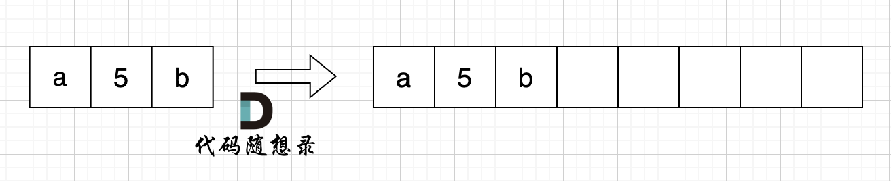

# 替换数字

> 学习路径提示：本文主专题为「字符串」，同时收录于[双指针学习路线](https://programmercarl.com/algo/two-pointers/)。

[卡码网题目链接(opens new window)](https://kamacoder.com/problempage.php?pid=1064)

给定一个字符串 s，它包含小写字母和数字字符，请编写一个函数，将字符串中的字母字符保持不变，而将每个数字字符替换为number。

例如，对于输入字符串 "a1b2c3"，函数应该将其转换为 "anumberbnumbercnumber"。

对于输入字符串 "a5b"，函数应该将其转换为 "anumberb"

输入：一个字符串 s,s 仅包含小写字母和数字字符。

输出：打印一个新的字符串，其中每个数字字符都被替换为了number

样例输入：a1b2c3

样例输出：anumberbnumbercnumber

数据范围：1 <= s.length < 10000。

## [#](https://programmercarl.com/algo/string/kamacoder-0054-replace-digits.html#%E6%80%9D%E8%B7%AF)思路

如果想把这道题目做到极致，就不要只用额外的辅助空间了！ （不过使用Java和Python刷题的录友，一定要使用辅助空间，因为Java和Python里的string不能修改）

首先扩充数组到每个数字字符替换成 "number" 之后的大小。

例如 字符串 "a5b" 的长度为3，那么 将 数字字符变成字符串 "number" 之后的字符串为 "anumberb" 长度为 8。

如图：




然后从后向前替换数字字符，也就是双指针法，过程如下：i指向新长度的末尾，j指向旧长度的末尾。


有同学问了，为什么要从后向前填充，从前向后填充不行么？

从前向后填充就是O(n^2)的算法了，因为每次添加元素都要将添加元素之后的所有元素整体向后移动。

其实很多数组填充类的问题，其做法都是先预先给数组扩容带填充后的大小，然后在从后向前进行操作。

这么做有两个好处：

不用申请新数组。
从后向前填充元素，避免了从前向后填充元素时，每次添加元素都要将添加元素之后的所有元素向后移动的问题。
C++代码如下：

```C++
#include <iostream></iostream>
using namespace std;
int main() {
    string s;
    while (cin >> s) {
        int sOldIndex = s.size() - 1;
        int count = 0; // 统计数字的个数
        for (int i = 0; i < s.size(); i++) {
            if (s[i] >= '0' && s[i] <= '9') {
                count++;
            }
        }
        // 扩充字符串s的大小，也就是将每个数字替换成"number"之后的大小
        s.resize(s.size() + count * 5);
        int sNewIndex = s.size() - 1;
        // 从后往前将数字替换为"number"
        while (sOldIndex >= 0) {
            if (s[sOldIndex] >= '0' && s[sOldIndex] <= '9') {
                s[sNewIndex--] = 'r';
                s[sNewIndex--] = 'e';
                s[sNewIndex--] = 'b';
                s[sNewIndex--] = 'm';
                s[sNewIndex--] = 'u';
                s[sNewIndex--] = 'n';
            } else {
                s[sNewIndex--] = s[sOldIndex];
            }
            sOldIndex--;
        }
        cout << s << endl;
    }
}
```

时间复杂度：O(n)
空间复杂度：O(1)

## Python：

```Python
class Solution(object):
    def subsitute_numbers(self, s):
        """
        :type s: str
        :rtype: str
        """
    
        count = sum(1 for char in s if char.isdigit()) # 统计数字的个数
        expand_len = len(s) + (count * 5)  # 计算扩充后字符串的大小， x->number， 每有一个数字就要增加五个长度
        res = [''] * expand_len
    
        new_index = expand_len - 1 # 指向扩充后字符串末尾
        old_index = len(s) - 1 # 指向原字符串末尾
    
        while old_index >= 0: # 从后往前， 遇到数字替换成“number”
            if s[old_index].isdigit():
                res[new_index-5:new_index+1] = "number"
                new_index -= 6
            else:
                res[new_index] = s[old_index]
                new_index -= 1
            old_index -= 1
    
        return "".join(res)
    
if __name__ == "__main__":
    solution = Solution()

    while True:
        try:
            s = input()
            result = solution.subsitute_numbers(s)
            print(result)
        except EOFError:
            break
```
