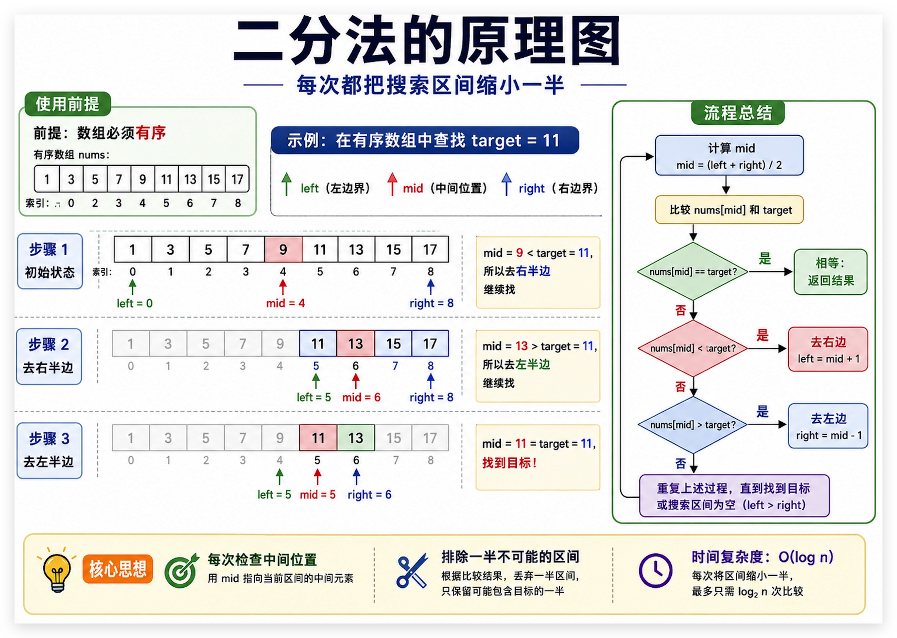
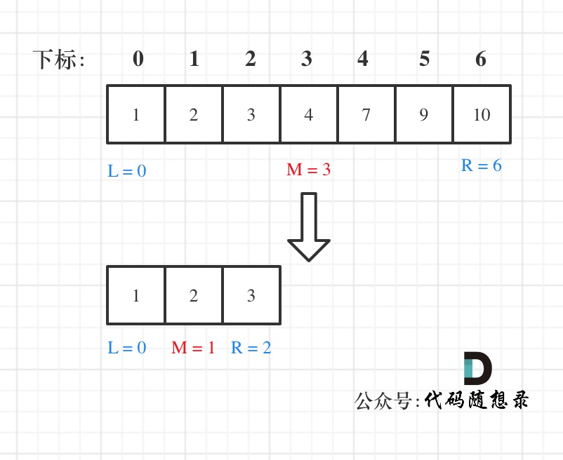
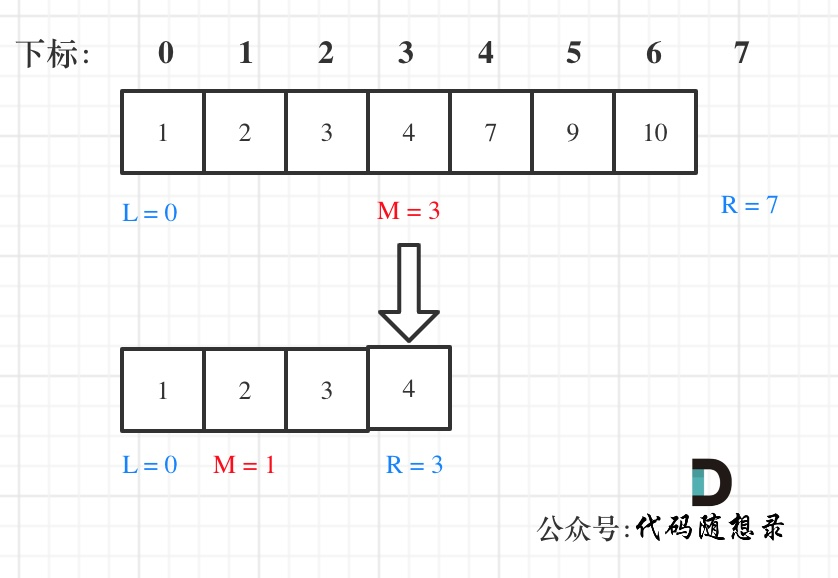

# 二、数组



## 题目
```
给定一个 n 个元素有序的（升序）整型数组 nums 和一个目标值 target  ，写一个函数搜索 nums 中的 target，如果目标值存在返回下标，否则返回 -1。
```

### 讲解思路
```
**这道题目的前提是数组为有序数组，同时题目还强调数组中无重复元素，因为一旦有重复元素，使用二分查找法返回的元素下标可能不是唯一的**，这些都是使用二分法的前提条件，当大家看到题目描述满足如上条件的时候，可要想一想是不是可以用二分法了。

二分查找涉及的很多的边界条件，逻辑比较简单，但就是写不好。例如到底是 while(left < right) 还是 while(left <= right)，到底是right = middle呢，还是要right = middle - 1呢？

大家写二分法经常写乱，主要是因为对区间的定义没有想清楚，区间的定义就是不变量。要在二分查找的过程中，保持不变量，就是在while寻找中每一次边界的处理都要坚持根据区间的定义来操作，这就是循环不变量规则。

写二分法，区间的定义一般为两种，左闭右闭即[left, right]，或者左闭右开即[left, right)。

下面我用这两种区间的定义分别讲解两种不同的二分写法。
```
## 实现过程

## 第一种写法
第一种写法，我们定义 target 是在一个在左闭右闭的区间里，也就是[left, right] （这个很重要非常重要）。

区间的定义这就决定了二分法的代码应该如何写，因为定义target在[left, right]区间，所以有如下两点：
```
while (left <= right) 要使用 <= ，因为left == right是有意义的，所以使用 <=
if (nums[middle] > target) right 要赋值为 middle - 1，因为当前这个nums[middle]一定不是target，那么接下来要查找的左区间结束下标位置就是 middle - 1
例如在数组：1,2,3,4,7,9,10中查找元素2，
```
如图所示：


```python
class Solution:
    def search(self, nums: List[int], target: int) -> int:
        left, right = 0, len(nums) - 1  # 定义target在左闭右闭的区间里，[left, right]

        while left <= right:
            middle = left + (right - left) // 2
            
            if nums[middle] > target:
                right = middle - 1  # target在左区间，所以[left, middle - 1]
            elif nums[middle] < target:
                left = middle + 1  # target在右区间，所以[middle + 1, right]
            else:
                return middle  # 数组中找到目标值，直接返回下标
        return -1  # 未找到目标值
```


## 第二种写法

如果说定义 target 是在一个在左闭右开的区间里，也就是[left, right) ，那么二分法的边界处理方式则截然不同。

有如下两点：

while (left < right)，这里使用 < ,因为left == right在区间[left, right)是没有意义的
if (nums[middle] > target) right 更新为 middle，因为当前nums[middle]不等于target，去左区间继续寻找，而寻找区间是左闭右开区间，所以right更新为middle，即：下一个查询区间不会去比较nums[middle]
在数组：1,2,3,4,7,9,10中查找元素2，如图所示：（注意和方法一的区别）


```pthon
class Solution:
    def search(self, nums: List[int], target: int) -> int:
        left, right = 0, len(nums)  # 定义target在左闭右开的区间里，即：[left, right)

        while left < right:  # 因为left == right的时候，在[left, right)是无效的空间，所以使用 <
            middle = left + (right - left) // 2

            if nums[middle] > target:
                right = middle  # target 在左区间，在[left, middle)中
            elif nums[middle] < target:
                left = middle + 1  # target 在右区间，在[middle + 1, right)中
            else:
                return middle  # 数组中找到目标值，直接返回下标
        return -1  # 未找到目标值

```