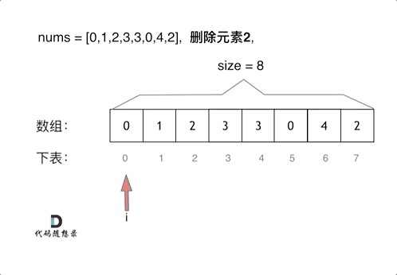

## 题目
```
给你一个数组 nums 和一个值 val，你需要 原地 移除所有数值等于 val 的元素，并返回移除后数组的新长度。

不要使用额外的数组空间，你必须仅使用 O(1) 额外空间并原地修改输入数组。

元素的顺序可以改变。你不需要考虑数组中超出新长度后面的元素。
```

### 讲解思路

要知道数组的元素在内存地址中是连续的，不能单独删除数组中的某个元素，只能覆盖。


### 1. 暴力求解

这个题目暴力的解法就是两层for循环，一个for循环遍历数组元素 ，第二个for循环更新数组。

删除过程如下：


很明显暴力解法的时间复杂度是O(n^2)，这道题目暴力解法在leetcode上是可以过的。

### 1.1 整体思路
```
变量说明
i：当前正在检查的元素下标（遍历指针）
l：数组当前的有效长度（每删除一个元素，有效长度就减 1，用来控制遍历终点

整体逻辑
用 i 从头到尾遍历数组的有效范围
如果发现 nums[i] 等于目标值 val：
把 i 后面所有的元素整体向前平移一位，覆盖掉当前这个要删除的元素
有效长度 l 减 1（相当于末尾的位置作废）
i 回退 1 位（因为平移过来的新元素还没检查，避免漏判）
无论是否删除元素，最后 i 都自增 1，继续检查下一个位置
```

代码如下：
```python
// 时间复杂度：O(n^2)
// 空间复杂度：O(1)
# i：当前正在检查的元素下标（遍历指针）
# l：数组当前的有效长度（每删除一个元素，有效长度就减 1，用来控制遍历终点）
class Solution:
    def removeElement(self, nums: List[int], val: int) -> int:
        i, l = 0, len(nums)
        while i < l:
            if nums[i] == val: # 找到等于目标值的节点
                for j in range(i+1, l): # 移除该元素，并将后面元素向前平移
                    nums[j - 1] = nums[j]
                l -= 1  # 有效长度-1，最后的会被扔掉
                i -= 1  # 指针回退
            i += 1
        return l
```
时间复杂度：O(n^2)
空间复杂度：O(1)


### 2.双指针法

双指针法（快慢指针法）： 通过一个快指针和慢指针在一个for循环下完成两个for循环的工作。

定义快慢指针

快指针：寻找新数组的元素 ，新数组就是不含有目标元素的数组
慢指针：指向更新 新数组下标的位置
核心思路：
不搞 “删除元素 + 全体平移” 的麻烦操作，直接把所有「不用删的好元素」挨个搬到数组最前面，最后慢指针的位置就是新数组的长度。

打个生活化的比方：

你面前摆了一排盒子，里面有的装苹果（要保留），有的装梨（要删掉），你要把苹果都整理到左边摆整齐。

- **快指针**：你的眼睛，从左到右挨个扫每个盒子，判断里面是苹果还是梨。
- **慢指针**：你的手，标记「下一个苹果应该放在哪个盒子里」。

整个过程只需要走一遍盒子，不用反复搬来搬去，比暴力解法高效得多。

删除过程如下：


```python
class Solution:
    def removeElement(self, nums: List[int], val: int) -> int:
        # 快慢指针
        fast = 0  # 快指针：负责挨个检查元素
        slow = 0  # 慢指针：标记下一个“好元素”该放的位置
        size = len(nums)# 数组总长度
        while fast < size:  # 不加等于是因为，a = size 时，nums[a] 会越界
            # slow 用来收集不等于 val 的值，如果 fast 对应值不等于 val，则把它与 slow 替换
            if nums[fast] != val:
                nums[slow] = nums[fast]# 让这个人站到引导员指的空位上
                slow += 1# 引导员往后退一步，指向下一个空位
            fast += 1# 检查员往前走，去检查下一个人
        return slow # 返回最终长度
```


注意这些实现方法并没有改变元素的相对位置！

时间复杂度：O(n)
空间复杂度：O(1)