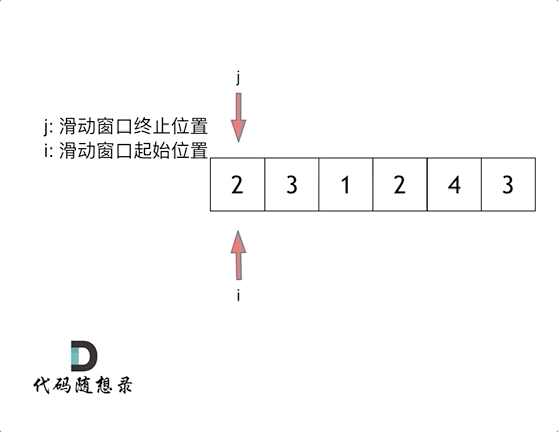

# 二、数组
## 题目
```
给定一个含有 n 个正整数的数组和一个正整数 s ，找出该数组中满足其和 ≥ s 的长度最小的 连续 子数组，并返回其长度。如果不存在符合条件的子数组，返回 0。
```

### 1.暴力解法
```
整体思路：
把数组里**每一个位置都当成子数组的开头**，然后从这个开头开始，往后一个一个累加元素，直到加起来的和 ≥ 目标 s 就停下，算一下当前子数组的长度，全程记录下最短的那个长度。

这道题目暴力解法当然是两个for循环，然后不断的寻找符合条件的子序列，时间复杂度很明显是O(n^2)。
```
代码如下：
```python
（版本一）暴力法
class Solution:
    def minSubArrayLen(self, s: int, nums: List[int]) -> int:
        l = len(nums)
        min_len = float('inf')     # 初始化“最短长度”为无穷大 ==> 一开始还没找到符合条件的，先设个超大数，后面找到更短的就更新它 
        for i in range(l):  # 外层循环：i 是子数组的「起点」==> 从第0个数、第1个数……挨个当起点试一遍
            cur_sum = 0     # 每次换一个新起点，累加和都要清零，重新算
            for j in range(i, l):   # 内层循环：j 是子数组的「终点」==>从起点 i 开始，往后一个数一个数地加
                cur_sum += nums[j]  # 把第 j 个数加到总和里
                if cur_sum >= s:
                    min_len = min(min_len, j - i + 1)   # 算一下这段子数组的长度：终点 - 起点 + 1 和当前记录的最短长度比，谁小就留下谁
                    break   # 直接跳出内层循环     
        return min_len if min_len != float('inf') else 0
```
时间复杂度：O(n^2)
空间复杂度：O(1)
后面力扣更新了数据，暴力解法已经超时了。


### 2.滑动窗口
```
接下来就开始介绍数组操作中另一个重要的方法：滑动窗口。

所谓滑动窗口，就是不断的调节子序列的起始位置和终止位置，从而得出我们想要的结果。

整体思路：
```
维护一个「窗口」—— 就是 `left` 到 `right` 之间的连续子数组：

- **右指针 `right`**：负责把窗口往右扩大，把元素一个个加进总和里
- **左指针 `left`**：一旦窗口里的总和 ≥ 目标值 `s`，就试着往右收缩窗口，看看能不能在 “总和还满足要求” 的前提下，让窗口变得更短
- 全程一边伸缩窗口，一边记录满足条件的最短窗口长度

打个比方:
-用一个可拉伸的框子在数组上滑动，右边负责往里装东西，装到重量达标了，就试着从左边往外拿，看看拿到多少的时候刚好还达标，同时记下此时框子的最小长度。
```

滑动窗口的起始位置如何移动呢？
```
这里还是以题目中的示例来举例，s=7， 数组是[2，3，1，2，4，3]，来看一下查找的过程：

最后找到 4，3 是最短距离。

解题的关键在于 窗口的起始位置如何移动，如图所示：


可以发现滑动窗口的精妙之处在于根据当前子序列和大小的情况，不断调节子序列的起始位置。从而将O(n^2)暴力解法降为O(n)。

python代码如下：
```python
（版本二）滑动窗口法
class Solution:
    def minSubArrayLen(self, s: int, nums: List[int]) -> int:
        l = len(nums)             # 数组总长度，用来控制循环边界
        left = 0                  # 窗口左边界（左指针），初始在数组开头
        right = 0                 # 窗口右边界（右指针），初始也在数组开头
        min_len = float('inf')    # 记录最短长度，初始设为float('inf') ->「正无穷大」
        cur_sum = 0               #当前窗口的累加值
        
        while right < l:          # 外层循环：右指针还没走到数组末尾，就一直循环
            cur_sum += nums[right]
            
            while cur_sum >= s:         # 内层循环：总和达标后，收缩左边界
                min_len = min(min_len, right - left + 1)# 更新最短长度
                cur_sum -= nums[left]   # 把左指针的元素从总和里去掉，当前窗口总和 = 当前窗口总和 - 左指针位置的数值
                left += 1               # 左指针右移，窗口缩小
            
            right += 1
        
        return min_len if min_len != float('inf') else 0
```

时间复杂度：O(n)
空间复杂度：O(1)
```
时间复杂度是O(n)：不要以为for里放一个while就以为是O(n^2)啊， 主要是看每一个元素被操作的次数，每个元素在滑动窗后进来操作一次，出去操作一次，每个元素都是被操作两次，所以时间复杂度是 2 × n 也就是O(n)。
```