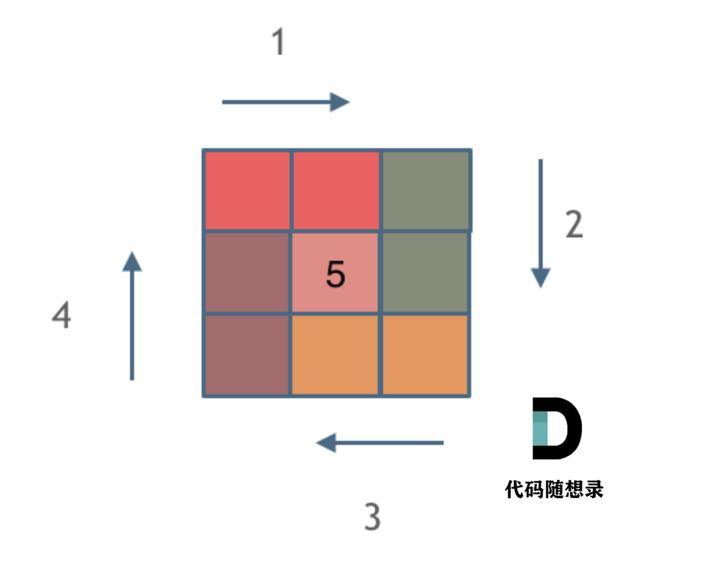

# 二、数组
## 题目（频率较高）
```
给定一个正整数 n，生成一个包含 1 到 n^2 所有元素，且元素按顺时针顺序螺旋排列的正方形矩阵。
```

#整体思路：
```
这道题是生成一个 `n × n` 的**顺时针螺旋矩阵**，从数字 1 开始，沿着外圈顺时针一圈一圈往里填数字，直到填满整个矩阵。

核心技巧就一句话：**分层填圈 + 左闭右开原则**

- 把矩阵看成一层一层的 “方框”，从最外圈开始，填完一圈往里缩一圈，一共要填 `n//2` 圈
- 每一圈分 4 条边：上边从左到右、右边从上到下、下边从右到左、左边从下到上
- 每条边都遵循「左闭右开」：只填开头的格子，结尾的格子留给下一条边填，这样四个角就不会重复填数
```

打个比方：你沿着正方形跑道跑圈，每条边跑到拐角前就停下，把拐角交给下一条边的起点，这样每个拐角只走一次，不会重复。

模拟顺时针画矩阵的过程:
```
填充上行从左到右
填充右列从上到下
填充下行从右到左
填充左列从下到上
由外向内一圈一圈这么画下去。
```

那么我按照左闭右开的原则，来画一圈，大家看一下：



这里每一种颜色，代表一条边，我们遍历的长度，可以看出每一个拐角处的处理规则，拐角处让给新的一条边来继续画。

坚持了每条边左闭右开的原则。

代码如下，已经详细注释了每一步的目的，可以看出while循环里判断的情况是很多的，代码里处理的原则也是统一的左闭右开。

整体代码如下：
```python
class Solution:
    def generateMatrix(self, n: int) -> List[List[int]]:
        nums = [[0] * n for _ in range(n)]
        startx, starty = 0, 0               # 起始点
        loop, mid = n // 2, n // 2          # 迭代次数、n为奇数时，矩阵的中心点
        count = 1                           # 计数
        # `offset` 作用是：当前在填第几圈-->- `offset=1`：第 1 圈 = 最外圈
# - `offset=2`：第 2 圈 = 往里缩一层的内圈
        for offset in range(1, loop + 1) :      # 每循环一层偏移量加1，偏移量从1开始
            for i in range(starty, n - offset) :    # 第一条边：上边，从左至右，左闭右开
                nums[startx][i] = count
                count += 1
            for i in range(startx, n - offset) :    # 第二条边：右边，从上至下
                nums[i][n - offset] = count
                count += 1
            for i in range(n - offset, starty, -1) : # 第三条边：下边，从右至左
                nums[n - offset][i] = count
                count += 1
            for i in range(n - offset, startx, -1) : # 第四条边：左边，从下至上
                nums[i][starty] = count
                count += 1                
            startx += 1         # 更新起始点
            starty += 1

        if n % 2 != 0 :			# n为奇数时，填充中心点
            nums[mid][mid] = count 
        return nums
```
