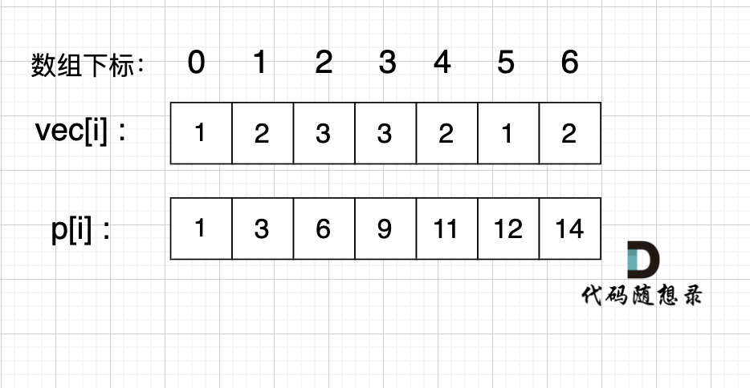
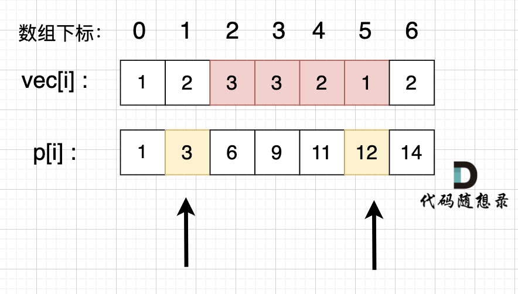

# 二、数组
## 题目
```
给定一个整数数组 Array，请计算该数组在每个指定区间内元素的总和。
```
输入描述

第一行输入为整数数组 Array 的长度 n，接下来 n 行，每行一个整数，表示数组的元素。随后的输入为需要计算总和的区间，直至文件结束。

输出描述

输出每个指定区间内元素的总和。


## 解题思路

数组上常用的解题技巧：前缀和

前缀和的思想是重复利用计算过的子数组之和，从而降低区间查询需要累加计算的次数。

前缀和 在涉及计算区间和的问题时非常有用！

前缀和的思路其实很简单，我给大家举个例子很容易就懂了。

例如，我们要统计 vec[i] 这个数组上的区间和。

我们先做累加，即 p[i] 表示 下标 0 到 i 的 vec[i] 累加 之和。

如图：


如果，我们想统计，在vec数组上 下标 2 到下标 5 之间的累加和，那是不是就用 p[5] - p[1] 就可以了。

为什么呢？

p[1] = vec[0] + vec[1];

p[5] = vec[0] + vec[1] + vec[2] + vec[3] + vec[4] + vec[5];

p[5] - p[1] = vec[2] + vec[3] + vec[4] + vec[5];

这不就是我们要求的 下标 2 到下标 5 之间的累加和吗。

如图所示：

p[5] - p[1] 就是 红色部分的区间和。

而 p 数组是我们之前就计算好的累加和，所以后面每次求区间和的之后 我们只需要 O(1) 的操作。

特别注意： 在使用前缀和求解的时候，要特别注意 求解区间。

如上图，如果我们要求 区间下标 [2, 5] 的区间和，那么应该是 p[5] - p[1]，而不是 p[5] - p[2]。

代码如下:
```python
import sys
input = sys.stdin.read

# 1. 读取并拆分所有输入数据
def main():
    data = input().split()  # `split()`：字符串方法，默认按**所有空白字符**（空格、换行符、制表符）切割，返回一个字符串列表。不管输入是换行写还是空格隔开，`split()` 都会把所有数字切成一个平铺的列表。
    index = 0

    # 2. 读取数组长度和原数组
    n = int(data[index])
    index += 1
    vec = []
    for i in range(n):
        vec.append(int(data[index + i]))
    index += n

    # 3. 核心：构建前缀和数组
    p = [0] * n
    presum = 0
    for i in range(n):
        presum += vec[i]
        p[i] = presum   # `p[i]` 表示：**原数组从第 0 个元素到第 i 个元素的总和**（也就是前 i+1 个元素的累加和）。
    ```
    有了前缀和数组，求任意区间 `[a, b]` 的和，就不用再循环累加了，直接用公式：
    > 区间和 = 从 0 加到 b 的和 - 从 0 加到 a-1 的和
    也就是 `p[b] - p[a-1]`，一步算出结果。
    ```
    # 4. 处理多组查询
    results = []                # 用一个列表存所有查询结果，最后统一打印
    while index < len(data):    #只要指针还没走到数据末尾，就继续处理查询。
        a = int(data[index])
        b = int(data[index + 1])
        index += 2

        if a == 0:
            sum_value = p[b]
        else:
            sum_value = p[b] - p[a - 1]

        results.append(sum_value)

    for result in results:
        print(result)

if __name__ == "__main__":
    main()
```

## remark
```
`input().split()` 之后得到的 `data` 就是：
['5', '1', '2', '3', '4', '5', '0', '2', '1', '3']
```

## 举例说明

### 输入

```
3
10 20 30
0 0
1 2
0 2
```

### 执行过程

1. `data = ['3','10','20','30','0','0','1','2','0','2']`
2. `n=3`，`index=1`
3. `vec = [10,20,30]`，`index=4`
```
- 现在 index=1，要连续读 3 个元素，分别读 `data[1]`、`data[2]`、`data[3]`
- 对应内容：10、20、30 → 放进 vec，得到 `vec = [10, 20, 30]`
- 读完 3 个元素，书签一次性往后跳 3 位：`index = 1 + 3 = 4`
```
4. 前缀和数组 `p = [10, 30, 60]`
5. 处理查询：
   - 查询 1：`a=0, b=0` → 和 = `p[0] = 10`
   - 查询 2：`a=1, b=2` → 和 = `p[2]-p[0] = 60-10 = 50`
   - 查询 3：`a=0, b=2` → 和 = `p[2] = 60`
6. 输出：
```
10
50
60
```

---

## 四、关键知识点总结

1. **前缀和核心作用**：O (n) 预处理，O (1) 求区间和，适合多次查询的场景。
2. **区间和公式**：`[a, b]` 闭区间和 = `p[b] - (p[a-1] if a>0 else 0)`
3. **IO 优化技巧**：大数据量下用 `sys.stdin.read` 一次性读入、结果攒起来统一打印，能显著提升速度。
4. **指针读取法**：用 `index` 指针在平铺的输入列表里移动取数，是处理多组输入的常用写法。
